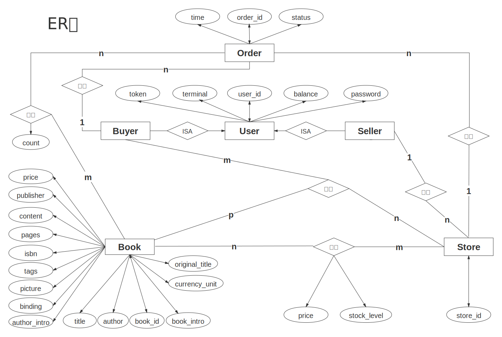
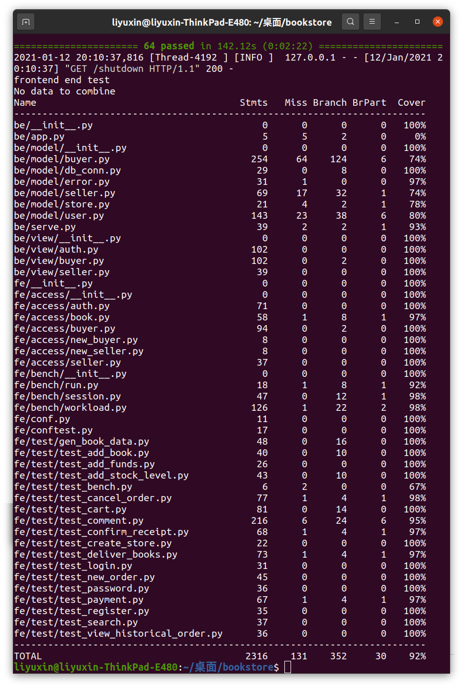

# 数据库期末大作业-Online bookstore

[](https://travis-ci.org/lccbks/bookstore)
[](https://codecov.io/gh/lccbks/bookstore)
[](https://coveralls.io/github/lccbks/bookstore?branch=main)

- [数据库期末大作业-Online bookstore](#数据库期末大作业-online-bookstore)
  * [〇、安装运行](#〇安装运行)
  * [〇、项目结构](#〇项目结构)
  * [一、数据库设计](#一数据库设计)
    + [ER图](#er图)
    + [Schema](#schema)
  * [二、功能实现](#二功能实现)
    + [2.1 用户](#21-用户)
      - [f1. 注册](#f1-注册)
      - [f2. 登录](#f2-登录)
      - [f3. 登出](#f3-登出)
      - [f4. 修改密码](#f4-修改密码)
      - [f5. 注销](#f5-注销)
    + [2.2 卖家](#22-卖家)
      - [f6. 创建商店](#f6-创建商店)
      - [f7. 上架书籍](#f7-上架书籍)
      - [f8. 增加库存](#f8-增加库存)
      - [f9. 发货*](#f9-发货)
    + [2.3 买家](#23-买家)
      - [f10. 下单*](#f10-下单)
      - [f11. 支付*](#f11-支付)
      - [f12. 充值](#f12-充值)
      - [f13. 确认收货*](#f13-确认收货)
      - [f14. 查询订单状态*](#f14-查询订单状态)
      - [f15. 手动取消订单*](#f15-手动取消订单)
      - [f16. 超时自动取消*](#f16-超时自动取消)
      - [f17. 图书评论*](#f17-图书评论)
      - [f18. 购物车*](#f18-购物车)
      - [f19. 历史记录*](#f19-历史记录)
    + [2.4 搜索*](#24-搜索)
  * [三、其他](#三其他)
    + [3.1 测试及覆盖率](#31-测试及覆盖率)
    + [3.2 吞吐量测试](#32-吞吐量测试)
    + [3.3 Git](#33-git)
    + [3.4 持续集成](#34-持续集成)
  * [四、分工](#四分工)


## 〇、安装运行

```shell
# 安装 Python 3.8
# 安装依赖
pip3 install -r requirements.txt

# 安装 Mysql 8.0
# 修改be/model/store.py中Store类中get_db_conn方法password字段值为Mysql数据库root用户的密码
# 初始化数据库
mysql -u root -p<your password> < create_user.sql
mysql -u bookstore -pBookstore@2020 < bookstore.sql

# 执行测试
bash script/test.sh
```


## 〇、项目结构

```shell
.
├── be
│   ├── app.py						# 启动flask后端
│   ├── __init__.py
│   ├── model						# 功能实现
│   │   └── ...
│   ├── serve.py
│   └── view						# flask 前端接口
│       └── ...
├── bookstore.sql					# 数据库初始化
├── doc								# JSON API
│   └── ...
├── fe								# 测试
│   ├── access						# http访问接口
│   │   └── ...
│   ├── bench						# 吞吐量测试
│   │   └── ...
│   ├── conf.py						# 测试参数
│   ├── conftest.py					# pytest测试配置
│   ├── data
│   │   ├── book.db					# 少量测试数据
│   │   └── scraper.py				# 数据爬取
│   ├── __init__.py
│   └── test						# 功能及覆盖率测试
│       └── ...
├── image
│   └── ...
├── README.md
├── requirements.txt
├── script
│   └── test.sh
└── setup.py

```


## 一、数据库设计

### ER图



**实体：** 用户、商店、订单和书籍四个实体类，其中用户包括*买家*和*卖家*两个子类

**实体属性：**

- 用户：主键用户id、密码、余额、终端标识、口令(token)
- 商店：主键商店id
- 订单：主键订单id、下单时间、订单状态(枚举类型：未付款、待发货、运送中、已完成、已取消、已超时)
- 书籍：主键书号、书名、原书名、作者、出版商、内容、书籍简介、作者简介、标签、页数、ISBN、价格、价格单位等

**实体联系：**

- 卖家开店：一对多关系，一位卖家可以拥有多家商店，一家商店只能被一位卖家拥有
- 买家下单：一对多关系，一位买家可以拥有多笔订单，一笔订单只能被一位买家拥有
- 商店接单：一对多关系，一家商店可以拥有多笔订单，一笔订单只能被一家商店拥有
- 订单详情：多对多关系，一笔订单可以包括多册书，一册书也可以被多笔订单拥有
- 商店存货：多对多关系，一册书可以被多家商店拥有，一家商店也可以拥有多册书
- 用户评论：多对多关系，一位买家可以对多家商店下的多本书进行评论，一家商店下的一册书也可以由多为买家评论


### Schema

- user：存放用户的相关属性：id、密码、余额、终端标识、token

  user_id为主键，由于对于用户的查询都是通过主键完成的，所以不需要再添加额外的索引

  ```shell
  +----------+--------------+------+-----+---------+-------+
  | Field    | Type         | Null | Key | Default | Extra |
  +----------+--------------+------+-----+---------+-------+
  | user_id  | varchar(200) | NO   | PRI | NULL    |       |
  | password | text         | NO   |     | NULL    |       |
  | balance  | int          | NO   |     | NULL    |       |
  | token    | text         | YES  |     | NULL    |       |
  | terminal | text         | YES  |     | NULL    |       |
  +----------+--------------+------+-----+---------+-------+
  ```

- user_store：如果将 `user_id` 置于 `store` 表中会产生大量冗余因此单独建一张表

  ```shell
  +----------+--------------+------+-----+---------+-------+
  | Field    | Type         | Null | Key | Default | Extra |
  +----------+--------------+------+-----+---------+-------+
  | user_id  | varchar(200) | NO   | PRI | NULL    |       |
  | store_id | varchar(200) | NO   | PRI | NULL    |       |
  +----------+--------------+------+-----+---------+-------+
  ```

- store：存放商店属性：id、书籍、书籍信息、库存

  将store_id和book_id作为联合主键，建立索引，可以大大加快搜索某书和其对应的店铺以及某店铺以及其对应的书的查询

  ```shell
  +-------------+--------------+------+-----+---------+-------+
  | Field       | Type         | Null | Key | Default | Extra |
  +-------------+--------------+------+-----+---------+-------+
  | store_id    | varchar(200) | NO   | PRI | NULL    |       |
  | book_id     | varchar(200) | NO   | PRI | NULL    |       |
  | book_info   | longtext     | YES  |     | NULL    |       |
  | stock_level | int          | YES  |     | NULL    |       |
  +-------------+--------------+------+-----+---------+-------+
  ```

- new_order：存放订单基本信息：订单id、用户id、商店id、下单时间、订单状态

  order_id为主键，订单表会频繁的进行插入和删除操作，所以不用再添加额外索引，以下类似

  ```shell
  +------------+----------------------+------+-----+-----------+----------+
  | Field      | Type                 | Null | Key | Default   | Extra    |
  +------------+----------------------+------+-----+-----------+----------+
  | order_id   | varchar(200)         | NO   | PRI | NULL      |          |
  | user_id    | varchar(200)         | YES  |     | NULL      |          |
  | store_id   | varchar(200)         | YES  |     | NULL      |          |
  | order_time | timestamp            | NO   |     | CURRENT_  | DEFAULT_ |
  |            |                      |      |     | TIMESTAMP | GENERATED|
  | state      | enum('unpaid',       | YES  |     | unpaid    |          |
  |            |      'undelivered',  |      |     |           |          |
  |            |      'delivering',   |      |     |           |          |
  |            |      'done',         |      |     |           |          |
  |            |      'cancelled',    |      |     |           |          |
  |            |      'timeout')      |      |     |           |          |
  +------------+----------------------+------+-----+-----------+----------+
  ```

- new_order_detail：存放订单详细信息，由于每个订单可能包含多册书，属于多对多的关系，因此单独建表

  ```shell
  +----------+--------------+------+-----+---------+-------+
  | Field    | Type         | Null | Key | Default | Extra |
  +----------+--------------+------+-----+---------+-------+
  | order_id | varchar(200) | NO   | PRI | NULL    |       |
  | book_id  | varchar(200) | NO   | PRI | NULL    |       |
  | count    | int          | YES  |     | NULL    |       |
  | price    | int          | YES  |     | NULL    |       |
  +----------+--------------+------+-----+---------+-------+
  ```

- unpay_order：存放未完成支付的订单，用于超时自动取消功能，避免每次查询 `new_order` 表

  ```shell
  +------------+--------------+------+-----+---------+-------+
  | Field      | Type         | Null | Key | Default | Extra |
  +------------+--------------+------+-----+---------+-------+
  | order_id   | varchar(200) | YES  |     | NULL    |       |
  | order_time | timestamp    | YES  |     | NULL    |       |
  +------------+--------------+------+-----+---------+-------+
  ```

- book_comment：存放书籍评论

  是用户、商店、书籍间的三元关系，可以对应到某一商店中的某一种书某一用户对该商店的该书的评价

  ```shell
  +----------+--------------+------+-----+---------+-------+
  | Field    | Type         | Null | Key | Default | Extra |
  +----------+--------------+------+-----+---------+-------+
  | user_id  | varchar(200) | NO   | PRI | NULL    |       |
  | store_id | varchar(200) | NO   | PRI | NULL    |       |
  | book_id  | varchar(200) | NO   | PRI | NULL    |       |
  | comment  | text         | YES  |     | NULL    |       |
  | rate     | int          | YES  |     | NULL    |       |
  +----------+--------------+------+-----+---------+-------+
  ```

- 以上各表均满足第三范式


## 二、功能实现

> 注：* 为基本功能之外的扩展

### 2.1 用户

#### f1. 注册

- 实现：直接对 `user` 表进行插入，如果返回插入失败则表示 `user_id` 已存在。
- 分析：仅涉及一次插入操作。


#### f2. 登录

- 实现：检查用户id与密码是否匹配，如果匹配则更新用户的终端标识和token信息，否则返回失败。
- 分析：涉及一次查询操作与一次更新操作。


#### f3. 登出

- 实现：检查用户是否处于登录状态，如果是则更新用户的终端标识和token，否则返回失败。
- 分析：涉及一次查询操作与一次更新操作。


#### f4. 修改密码

- 实现：检查用户id和密码是否匹配，如果是则更新用户密码信息，否则返回失败。
- 分析：涉及一次查询操作与一次更新操作。


#### f5. 注销

- 实现：检查用户id和密码是否匹配，是则根据用户id在 `user` 表中将用户信息删除，否则返回失败。
- 分析：涉及一次查询操作与一次删除操作。


### 2.2 卖家

#### f6. 创建商店

- 实现：检查 `user_id` 是否存在，存在的话检查 `store_id` 是否已被创建，如果没有则将该信息插入到 `user_store` 表中。
- 分析：涉及两次查询操作与一次插入操作。


#### f7. 上架书籍

- 实现：检查 `user_id` 与 `store_id` 是否存在，存在的话检查 `book_id` 是否已经添加到该商店中，如果没有则将书籍信息插入到 `store` 表中。
- 分析：涉及三次查询操作与一次插入操作。


#### f8. 增加库存

- 实现：检查 `user_id` 、`store_id` 和 `book_id` 是否存在，存在的话更新书籍库存。
- 分析：涉及三次查询操作与一次更新操作。


#### f9. 发货*

- 实现：检查 `user_id` 、`store_id` 和 `order_id` 是否存在，存在的话检查订单是否处于 `待发货` 状态，是的话更新订单状态为 `已发货`。
- 分析：涉及四次查询操作与一次更新操作。


### 2.3 买家

#### f10. 下单*

- 实现：

  - 检查 `user_id` 是否存在；
  - 检查 `store_id` 是否存在；
  - 根据 `book_id` 与 `store_id` 从 `store` 表中查询 `stock_level` 、`price` 等信息；
  - 根新商店的书籍库存信息；
  - 将 `order_id`  、`book_id` 、`count` 、`price` 等信息插入到 `new_order_detail` 表中；
  - 将 `order_id` 、`store_id` 、`user_id` 插入到 `new_order` 表中，订单时间默认为当前时间；
  - 将 `order_id` 和 `order_time` 添加到 `unpay_order` 中。

- 分析：根据每笔订单中所包含的书籍的册数不同，每次下单所需要进行的数据库操作次数也不同。假设该笔订单中共有 `N` 册书，则所需的数据库操作为：`2+N` 次查询，`N+2` 次插入，`N` 次更新。

- 优化：

  - 由于该功能所需要大量的数据操作，其中也涉及到很多的更新、插入操作，我们考虑在这里使用**存储过程**实现。

  - 使用存储过程有助于提高应用程序的性能，减少应用程序与数据库服务器之间的流量，不必发送大量的SQL语句，而只需要发送存储过程名和参数即可，除此之外，在应用程序中也不必再次开发存储过程中已经支持的功能。

  - 该功能的存储过程定义：

    ```sql
    drop procedure if exists bookstore.new_order;
    delimiter //
    create procedure bookstore.new_order(in user_id_ varchar(200), in store_id_ varchar(200), in order_id_ varchar(200), in book_ids varchar(1400), in counts varchar(1400), in book_num int, out flag int, out msg varchar(200))
    label:begin
    	declare user_num varchar(200) default '';
    	declare store_num varchar(200) default '';
    	declare book_id_ varchar(100);
    	declare book_count_ varchar(100);
    	declare i int default 1;
    	declare is_exist_ varchar(200) default '';
    	declare stock_level_ int default 0;
    	declare book_info_ longtext;
    	declare price_ int default 0;
    	declare is_enough_ int default 1;
    	declare time_ timestamp;
    	-- 捕获 sqlexception, 进行事务回滚
    	declare exit handler for sqlexception
    	begin
    	rollback;
    	set flag = 5;
    	set msg = 'store procedure "new_order" error';
    	end;
    	
    	select user_id into user_num from user where user_id=user_id_;
    	select store_id into store_num from user_store where store_id=store_id_;
    	
    	set flag = 0;
    	set msg = '';
    	
    	if length(user_num) = 0 then
    		set flag = 1; -- user_id 不存在
    		set msg = user_id_;
    		leave label;
    	elseif length(store_num) = 0 then
    		set flag = 2; -- store_id 不存在
    		set msg = store_id_;
    		leave label;
    	else
    		start transaction;	-- 开启事务	
    		insert into new_order(order_id, store_id, user_id)
    		values(order_id_, store_id_, user_id_);
    		
    		select order_time from new_order 
    		where order_id=order_id_
    		into time_;
    		
    		insert into unpay_order(order_id, order_time)
    		values(order_id_, time_);
    		
    		while i <= book_num do
    			set is_exist_ = '';
    			set book_id_ = substring_index(substring_index(book_ids,'&',i),'&',-1);
    			set book_count_ = substring_index(substring_index(counts,'&',i),'&',-1);
    			
    			select store_id, stock_level, book_info
    			from store 
    			where store_id=store_id_ and book_id=book_id_
    			into is_exist_, stock_level_, book_info_;
    			
    			if length(is_exist_) = 0 then
    				set flag = 3; -- book_id 不存在
    				set msg = book_id_;
    				rollback;
    			else
    				select stock_level_ >= book_count_ into is_enough_;
    				if is_enough_ = 0 then
    					set flag = 4; -- 库存不足
    					set msg = book_id_;
    					rollback;
    				else
    					select json_extract(book_info_,'$.price') into price_;
    					
    					update store set stock_level=stock_level-book_count_
    					where store_id=store_id_ and book_id=book_id_;
    					
    					insert into new_order_detail(order_id, book_id, count, price)
    					values(order_id_, book_id_, book_count_, price_);
    				end if;
    			end if;
    			set i = i + 1;
    		end while;
    		commit;
    	end if;
    end //
    delimiter ;
    ```

    

#### f11. 支付*

- 实现：
  - 检查 `order_id` 是否存在于 `unpay_order` 表中，如果不存在表示订单已不处于 `未支付` 状态，则无法进行支付，返回错误；
  - 检查 `order_id` 是否存在于 `new_order` 表中，如果不存在返回 `订单不存在` 错误；
  - 检查订单的 `buyer_id` 是否等于传入的 `user_id` ，如果不相等返回权限错误；
  - 检查 `user_id` 是否存在于 `user` 表中，如果不存在返回 `用户不存在` 错误；
  - 检查 `user_id` 和 `password` 是否匹配，如果不匹配返回权限错误；
  - 检查 `store_id` 是否存在，如果不存在返回 `商店不存在` 错误；
  - 检查 `seller_id` 是否存在，如果不存在返回 `卖家不存在` 错误；
  - 计算订单总价格，查询用户余额是否充足，如果不够返回 `余额不足` 错误；
  - 更新卖家和买家的收支，将订单状态修改为 `待发货` ，并从 `unpay_order` 中删除。
- 分析：同 `下单` 功能的实现一样，该功能所涉及的数据库操作次数与订单中的书籍数量有关，因此该功能也通过**存储过程**实现，存储过程定义在 `bookstore.sql` 文件中，在此处不再赘述。


#### f12. 充值

- 实现：检查用户id与密码是否匹配，匹配的话更新用户余额。
- 分析：涉及一次查询操作与一次更新操作。


#### f13. 确认收货*

- 实现：
  - 检查 `user_id` 与 `order_id` 是否存在；
  - 检查订单是否处于 `运送中` 状态，是的话更新订单状态为 `已收货` 。
- 分析：涉及三次查询与一次更新操作。


#### f14. 查询订单状态*

- 实现：查询 `user_id` 与 `order_id` 是否存在，从 `new_order` 表中查询订单状态。
- 分析：涉及三次查询操作。


#### f15. 手动取消订单*

- 实现：
  - 查询 `user_id` 是否存在及 `password` 是否匹配；
  - 查询 `order_id` 是否存在于表 `new_order` 中以及当前状态是否为 `已取消` ，是的话返回 `无法重复取消` 错误；
  - 查询商店是否存在，否的话返回 `商店不存在` 错误；
  - 查询卖家是否存在，否的话返回 `卖家不存在` 错误；
  - 如果订单状态为 `未支付` ，那么只需将订单状态改为 `已取消` 并从 `unpay_order` 表中删除即可；
  - 如果订单状态为其他，则将订单状态改为 `已取消` 并计算该订单的总价格然后更新买家和卖家收支。
- 分析：同 `下单` 与 `支付` 功能，该功能也与订单中包含的书籍数量有关，因此同样使用**存储过程**实现。该功能存储过的定义位于 `bookstore.sql` 文件中。


#### f16. 超时自动取消*

- 实现：遍历 `unpay_order` 表中的订单，判断是否已超时，如果使得话从 `unpay_order` 表中删除该订单，并将 `new_order` 表中该订单的状态修改为 `已超时` 。

- 分析：由于需要经常遍历 `unpay_order` 表，经查询后发现可以在 Mysql 服务器中设置**定时事件**，因此该功能的实现完全依赖于 Mysql 服务器，在数据库中定义自动取消功能的**存储过程**，并定义Mysql事件定时调用该存储过程，存储过程的定义位于 `bookstore.sql` 文件中，此处不再赘述，以下是该定时事件的定义：

  ```sql
  create event bookstore.e_auto_cancel on schedule every 1 minute do call auto_cancel(); -- 每分钟调用一次存储过程
  ```


#### f17. 图书评论*


#### f18. 购物车*


#### f19. 历史记录*


### 2.4 搜索*

#### f20. 全局搜索*

- 实现：搜索功能需要提前构建倒排索引表实现，利用用户输入的查询内容和对应的书号构建查询表，提前存储在数据库中，以便用户输入某查询时可以很快返回对应书的所有信息给用户。

  - search_title：用于存放搜索标题的查询，search_id和title查询内容组成联合主键，无需额外的索引

    考虑到用户在查询标题时存在记忆模糊的情况，可能会记不住整个标题，只记得标题的部分内容，因此构建的倒排索引应当包含只有部分标题的查询。所以在表内增加了标题全称和对应查询之间的记录之外，还增加了部分标题名和对应查询的记录。这里对于所有的标题，主要存在中文和英文两类，对于中文，采用jieba分词切分技术，将分词的结果存储在查询表中；对于英文，根据空格进行分词，将对应的单词存放在存储表中。

    ```shell
    +------------+--------------+------+-----+---------+-------+
    | Field      | Type         | Null | Key | Default | Extra |
    +------------+--------------+------+-----+---------+-------+
    | search_id  | int          | YES  | PRI | NULL    |       |
    | title      | varchar(200) | YES  | PRI | NULL    |       |
    | book_id    | varchar(200) | YES  |     | NULL    |       |
    +------------+--------------+------+-----+---------+-------+
    ```

  - search_author：用于存放搜索作者的查询，search_id和author查询内容组成联合主键，无需额外的索引

    考虑到用户在查询作者名时也存在记忆模糊的情况，可能会记不住作者全名，只记得作者名的部分内容（作者的姓氏），因此构建的倒排索引应当包含只有部分作者名的查询。所以在表内增加了作者全名和对应查询之间的记录之外，还增加了部分作者名和对应查询的记录。这里对于所有的作者，主要存在中文和英文两类，对于中文，存储包括作者的姓氏，作者名的前几个字等信息；对于英文，存储英文输入中存在少量错词（单词拼写错误）、漏词（字母遗漏，只记得作者名的前几个字母）的情况。

    ```shell
    +------------+--------------+------+-----+---------+-------+
    | Field      | Type         | Null | Key | Default | Extra |
    +------------+--------------+------+-----+---------+-------+
    | search_id  | int          | YES  | PRI | NULL    |       |
    | author     | varchar(200) | YES  | PRI | NULL    |       |
    | book_id    | varchar(200) | YES  |     | NULL    |       |
    +------------+--------------+------+-----+---------+-------+
    ```

  - search_book_intro：用于存放搜索内容关键词的查询，search_id和book_intro查询内容组成联合主键，无需额外的索引

    考虑到用户在查询内容时不可能将整个查询的内容全部放在查询表中，如果这么处理内容量太大了，这里采用了提取关键词的方式，通过首先对文章进行分词（中文jieba分词并剔除停用词，英文根据空格分词剔除常用和无意义的词）,计算所有词在文档中出现的频率，提取其中出现频率最高的一部分词（前百分之5）作为该书的关键词，存放在关键词查询表中。

    ```shell
    +------------+--------------+------+-----+---------+-------+
    | Field      | Type         | Null | Key | Default | Extra |
    +------------+--------------+------+-----+---------+-------+
    | search_id  | int          | YES  | PRI | NULL    |       |
    | book_intro | varchar(200) | YES  | PRI | NULL    |       |
    | book_id    | varchar(200) | YES  |     | NULL    |       |
    +------------+--------------+------+-----+---------+-------+
    ```

  - search_tags：用于存放搜索标签的查询，search_id和tags查询内容组成联合主键，无需额外的索引

    搜索标签在数据库中已经做好了分类，但考虑到该标签内容繁杂，每本书对应大量的标签，而且很多标签为组合词甚至短语如果直接让用户进行搜索，可能会出现搜索不到对应的词的情况，例如“人物传记”一个标签，用户单独搜索“传记”会查询不到相应的结果。所以同搜索标题表一样，对于中文进行了jieba分词处理，对于英文按照空格单词处理，在分好词的基础上将所有分词结果以及原先整个标题结果全部存储到查询表中。

    ```shell
    +------------+--------------+------+-----+---------+-------+
    | Field      | Type         | Null | Key | Default | Extra |
    +------------+--------------+------+-----+---------+-------+
    | search_id  | int          | YES  | PRI | NULL    |       |
    | tags       | varchar(200) | YES  | PRI | NULL    |       |
    | book_id    | varchar(200) | YES  |     | NULL    |       |
    +------------+--------------+------+-----+---------+-------+
    ```

    这样，每次进行查询的时候就从对应的单独查询表中进行查询，返回对应的书号id，这里建表可以过滤掉一些无用的信息，减少数据库冗余，提高检索的速度和检索的效率。

- 分析：从对应的查询表中执行select操作查找对应的结果返回，涉及user表一次查询操作与一次更新操作。


#### f21. 店铺内搜索*

- 实现：与全局搜索一致，增加了商店id号的信息，会在筛选条件中加上商店号的限制。具体实现功能包括根据标题搜索、根据作家信息搜索、根据标签搜索和根据书本关键词搜索。
- 分析：从对应的查询表中执行select操作查找对应的结果返回，涉及user表一次查询操作与一次更新操作。


## 三、其他

### 3.1 测试及覆盖率




### 3.2 吞吐量测试


### 3.3 Git


### 3.4 持续集成


## 四、分工

陈丘轲-10184102116：ER图设计，倒排索引表设计和实现，表初始化，git版本控制，搜索图书功能设计，搜索功能实现，PPT制作

陈熙之-10180000000：

李昱鑫-10174507132：数据库设计，user 基本功能实现，下单与支付的存储过程实现，手动/自动取消订单，Git，持续集成，README


